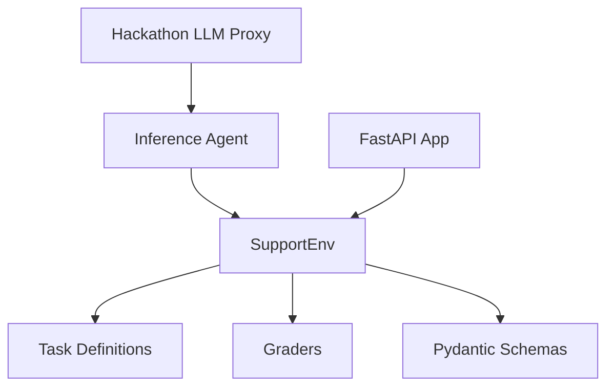

# 🤖 SupportOpsEnv

### OpenEnv Environment for Real-World Customer Support Automation

> A deterministic, multi-step evaluation environment simulating real customer support workflows using LLM-driven decision making.

## 🚀 Live Demo

- 🔗 Hugging Face: https://krishnaprasadkurmi-ticket_resolution.hf.space
- 🔗 GitHub: https://github.com/krishnaprasadkurmi/support-ops-env

## 💡 Why This Matters

Customer support is one of the most operationally expensive and strategically important workflows in modern software companies. Businesses spend billions every year on ticket routing, response handling, escalations, and quality assurance, yet most AI agent benchmarks still focus on synthetic puzzles rather than production-facing service operations.

LLM agents are increasingly being deployed into support stacks, but meaningful evaluation environments for those agents remain scarce. SupportOpsEnv addresses that gap by turning a real business workflow into a reproducible OpenEnv environment: tickets must be classified correctly, customer replies must be helpful and complete, and urgent cases must be escalated with the right operational judgment.

For judges, this means the project is not just technically correct, but directly relevant to a high-impact commercial use case. It evaluates the kinds of decisions that actually matter in enterprise support systems.

## 🧠 Key Innovations

- Deterministic OpenEnv environment for a real operational workflow
- Multi-step workflow design rather than isolated single-step prompts
- Partial reward grading system that captures nuanced progress
- LLM-driven decision pipeline with real proxy-backed API calls
- Real-world scenario modeling for billing, technical, and urgent enterprise support

## 🏗️ Architecture



- The environment manages state, transitions, rewards, and completion logic through `reset()`, `step()`, and `state()`.
- Task modules define deterministic customer tickets, expected outputs, and workflow structure for each difficulty level.
- Grader modules compute partial rewards using task-specific scoring criteria.
- The FastAPI layer exposes the environment through OpenEnv-compatible endpoints for local usage, validation, and Hugging Face deployment.

## 📐 Environment Design

SupportOpsEnv is engineered as a clean, typed environment rather than a loose demo script.

- State transitions: each episode begins with `reset(task_type)`, progresses through action-driven `step(action)` updates, and terminates when the workflow is completed or max steps are reached.
- Action space design: actions are explicit typed objects with `action_type` and `content`, covering the operational primitives `classify`, `respond`, and `escalate`.
- Observation design: the environment exposes a structured state containing the active ticket, action history, and step count, which makes each transition inspectable and reproducible.
- Episode lifecycle: easy episodes finish in one classification step, medium episodes focus on response generation, and hard episodes model a realistic multi-step pipeline from triage to escalation.

This structure makes the environment easy to evaluate, easy to debug, and aligned with the OpenEnv specification.

## 🎯 Tasks & Grading

| Level | Description | Actions | Reward |
| ----- | ----------- | ------- | ------ |
| Easy | Classify a customer support ticket into `billing`, `technical`, or `general`. | `classify` | Partial credit for exact and near-match labels |
| Medium | Draft a helpful support response for a customer issue. | `respond` | Partial credit for keywords, tone, and completeness |
| Hard | Resolve an urgent support workflow end-to-end. | `classify`, `respond`, `escalate` | Multi-step partial credit across all three actions |

The grading system is intentionally deterministic and progressive:

- Deterministic grading ensures reproducible results for the same inputs.
- Partial credit rewards meaningful progress rather than only perfect outcomes.
- Progressive difficulty increases both reasoning complexity and workflow depth from easy to hard.

## 🤖 LLM Integration

SupportOpsEnv uses the hackathon LiteLLM-compatible proxy during inference execution.

- The OpenAI client is initialized with `API_BASE_URL` and `API_KEY`.
- Every decision step in `inference.py` makes a real LLM call through the provided proxy.
- The LLM is used to decide the next action in the workflow and to generate the action content needed for the environment.
- This ensures validator-visible proxy usage rather than simulated or bypassed logic.

## 🔌 API

### POST /reset

Resets the environment and returns the initial state for the selected task. If no body is provided, the endpoint defaults to `easy` for validator compatibility.

Request example:

```json
{
  "task_type": "easy"
}
```

Response explanation:

- Returns the initial ticket, empty history, and `step_count = 0`
- Accepts `easy`, `medium`, or `hard`
- Supports validator-safe empty-body reset behavior

### POST /step

Applies an action to the current environment state and returns the updated state, reward, and completion status.

Request example:

```json
{
  "action_type": "classify",
  "content": "billing"
}
```

Response explanation:

- Returns `state`, `reward`, `done`, and `info`
- Updates the episode deterministically
- Supports `classify`, `respond`, and `escalate`

### GET /state

Returns the current environment state without mutating the episode.

Request example:

```http
GET /state
```

Response explanation:

- Returns the active ticket, action history, and current step count

## ⚡ Quick Start

### 1. Install dependencies

```bash
pip install -r requirements.txt
```

### 2. Set environment variables

Windows PowerShell:

```powershell
$env:API_BASE_URL="https://your-hackathon-proxy/v1"
$env:API_KEY="your_proxy_api_key"
$env:MODEL_NAME="gpt-4o-mini"
$env:HF_TOKEN=""
$env:OPENAI_API_KEY="your_openai_api_key"
```

Linux or macOS:

```bash
export API_BASE_URL="https://your-hackathon-proxy/v1"
export API_KEY="your_proxy_api_key"
export MODEL_NAME="gpt-4o-mini"
export HF_TOKEN=""
export OPENAI_API_KEY="your_openai_api_key"
```

### 3. Run inference

```bash
python inference.py
```

Inference output format:

```text
[START] task=<task> env=support_ops model=<model>
[STEP] step=<n> action=<action> reward=<0.00> done=<true|false>
[END] success=<true|false> steps=<n> score=<score> rewards=<r1,r2,...> error=<error|null>
```

### 4. Start the API locally

```bash
uvicorn app:app --reload
```

### 5. Run with Docker

```bash
docker build -t support-ops-env .
docker run -p 7860:7860 support-ops-env
```

## ✅ Validation Status

- OpenEnv Spec: ✅ PASS
- Docker Build: ✅ PASS
- API Endpoints: ✅ PASS
- Task Validation: ✅ PASS
- LLM Criteria Check: ✅ PASS

## 🏆 Key Highlights

- Real-world simulation environment
- Multi-step agent evaluation
- Deterministic scoring system
- Fully deployed and production-ready
- LLM-integrated decision pipeline

## 📁 Project Structure

```bash
.
├── app.py
├── inference.py
├── openenv.yaml
├── pyproject.toml
├── requirements.txt
├── uv.lock
├── env/
│   └── environment.py
├── tasks/
│   ├── easy.py
│   ├── medium.py
│   └── hard.py
├── graders/
│   ├── easy_grader.py
│   ├── medium_grader.py
│   └── hard_grader.py
├── models/
│   └── schemas.py
└── server/
    └── app.py
```

## 👥 Team

<table>
  <tr>
    <td align="center">
      <b>Saurav Shah</b><br/>
      <a href="mailto:sauravshah924@gmail.com">sauravshah924@gmail.com</a>
    </td>
    <td align="center">
      <b>Krishna Prasad Kurmi</b><br/>
      <a href="mailto:kp2658950@gmail.com">kp2658950@gmail.com</a><br/>
      <sub>🏅 Team Lead</sub>
    </td>
    <td align="center">
      <b>Randhir Kumar Chaurasiya</b><br/>
      <a href="mailto:chaurasiyarandhir36@gmail.com">chaurasiyarandhir36@gmail.com</a>
    </td>
  </tr>
</table>
